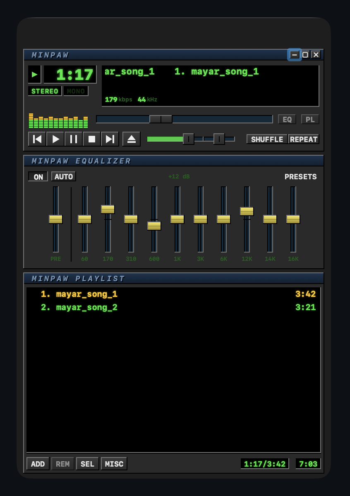

# Minpaw

A native macOS MP3 player built with SwiftUI and AVAudioEngine. Classic Winamp
three-panel aesthetic — player, 10-band equalizer, playlist — with beveled
plastic buttons, neon-green LCD readouts, yellow EQ thumbs, and a falling
spectrum analyzer.

<p align="center">
  
</p>

## Features

- Native SwiftUI window, fixed size, custom `_ □ ×` chrome controls
- Three stacked beveled panels with italic blue title bars (drag to move window)
- AVAudioEngine graph: `playerNode → AVAudioUnitEQ → mixer`
- 10-band parametric EQ (60 Hz – 16 kHz) + preamp + on/off + presets
  (Flat, Rock, Pop, Jazz, Classical, Bass Boost, Treble Boost, Vocal, Electronic)
- Live green/yellow/red spectrum bars rendered with `Canvas`
- Scrolling marquee track ticker over an LCD background
- Playlist: drag-and-drop, file picker, "Reveal in Finder", shuffle, repeat
- Reads ID3/iTunes metadata: title, artist, album, embedded artwork
- Supports MP3, M4A/AAC, WAV, AIFF, FLAC (anything AVFoundation can decode)

## Run

Requires macOS 14+ and Swift 5.9 (Xcode 15) toolchain.

```bash
# 1. Run from source
swift run

# 2. Or build a real .app bundle you can double-click
./build-app.sh release
open Minpaw.app
```

Then drag any `.mp3` (or other audio) files onto the window, or click **ADD**.

## Project layout

```
Sources/MP3Player/
  App.swift            – @main, window chrome (NSWindow customization)
  ContentView.swift    – three-panel stack, drop handling
  PlayerView.swift     – LCD time, ticker, kbps/kHz, spectrum, transport, volume
  EqualizerView.swift  – ON/AUTO/PRESETS + preamp + 10 yellow EQ sliders
  PlaylistView.swift   – monospaced track list, ADD/REM/SEL/MISC bottom bar
  Components.swift     – WinampPanel, Bevel, PlasticButton, LCDDisplay,
                         WinSlider, EQSlider, WindowDragHandle, palette
  PlayerEngine.swift   – AVAudioEngine wrapper, EQ, seek, spectrum tap
  Models.swift         – Track, RepeatMode, EQPreset
```

## Notes

- The `.app` bundle is ad-hoc codesigned (`codesign -s -`) so Gatekeeper allows
  local launch without quarantine fuss. For distribution, sign with a real
  Developer ID and notarize.
- Spectrum is per-band RMS of the live mixer output — responsive to overall
  energy, not spectrally accurate. Swap in vDSP FFT in
  `PlayerEngine.processSpectrum` if you want true frequency bins.
